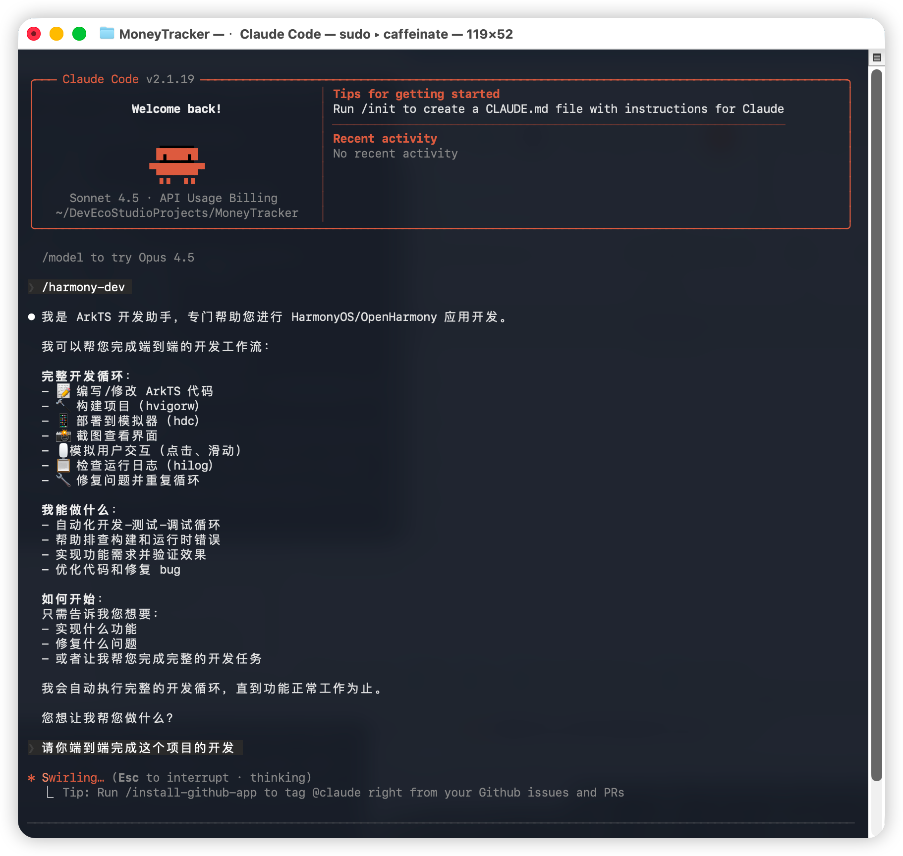
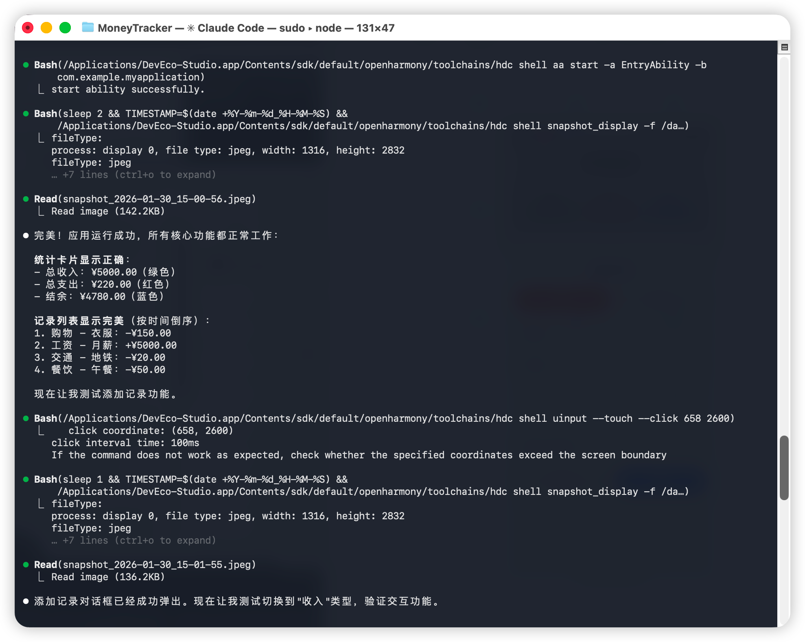

# Harmony Development Assistant

> ArkTS 开发助手，用于 HarmonyOS/OpenHarmony 应用开发端到端开发
  工作流（代码-构建-部署-测试-调试循环）。

## 使用方法

- 在开始提出需求前，先运行/harmony-dev，让AI了解如何使用这个skill，然后再提出需求。

## 实际使用效果





可以看到AI可以正确触发运行、看日志并解决问题.

## 和MCP配合使用

如果您希望避免Claude Code**使用过时的API而导致编译报错**，从而减少反复修改的过程，我推荐将这个skill配合 [Context7](https://github.com/upstash/context7/blob/master/i18n/README.zh-CN.md) 这个MCP一起使用。该MCP可以让Claude Code检索API对应的文档，找到API的正确用法。如果您已配置好这个MCP，可以在提示词中加入以下内容：

```plaintext
如果你使用了一个鸿蒙的接口却在编译时报错，请大胆使用context7这个MCP来查询鸿蒙的接口文档，libraryId: "/websites/developer_huawei_consumer_cn_doc_harmonyos-guides"
```